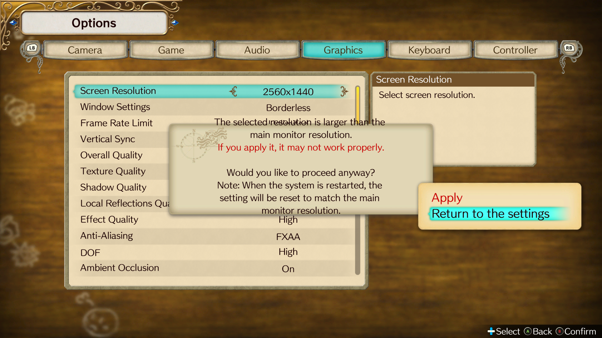
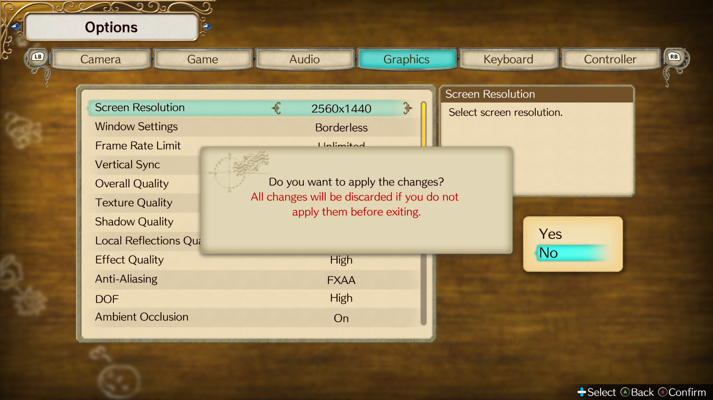
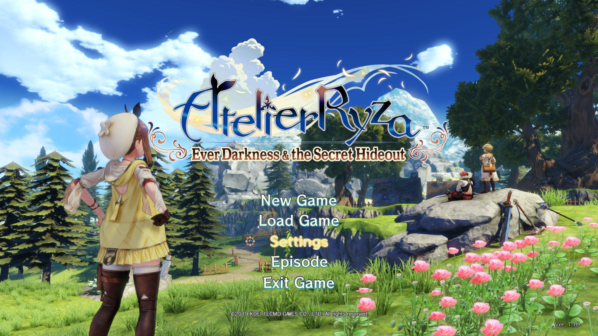

# GetSystemMetricsHook
Override the [**GetSystemMetrics**](https://learn.microsoft.com/en-us/windows/win32/api/winuser/nf-winuser-getsystemmetrics) parameters at runtime.

This hook allows you to override the parameters passed to the GetSystemMetrics function with your arbitrary values.

Every parameter [**here**](https://learn.microsoft.com/en-us/windows/win32/api/winuser/nf-winuser-getsystemmetrics#parameters) can be configured.

# Usage
This program has been designed so that it is **injected** into the application process. You can use any **DLL injector**, here are some examples.

### [SpecialK](https://github.com/SpecialKO/SpecialK)
You can use SpecialK [Custom Plugin](https://wiki.special-k.info/en/SpecialK/Tools#custom-plugin) feature to load the DLL along with it. I recommend setting **'When'** configuration to **'Early'**.

### [Ultimate ASI Loader](https://github.com/ThirteenAG/Ultimate-ASI-Loader)
A powerful multipurpose injector that's easy to configure.

Download the latest version taking into account whether the application is **x86** or **x64**, rename the Ultimate ASI Loader DLL to something that the application loads, most games use **'dinput8.dll'**. Place the **GetSystemMetrics(32|64).dll** inside the **root directory of the application** or in the **'scripts'**, **'plugins'**, or **'update'** folders.

I usually use the folder **'plugins'**, you should probably create it the first time you set it up in your application.

The Ultimate ASI Loader only reads files with the **.asi** extension, but these are only .dll files with the extension renamed.

Rename the extension of **GetSystemMetrics(32|64).dll** to **GetSystemMetrics(32|64).asi**.

### Configuration
Open the `GetSystemMetricsHook.toml` file and set any parameters you want which are documented [**here**](https://learn.microsoft.com/en-us/windows/win32/api/winuser/nf-winuser-getsystemmetrics#parameters).

> [!NOTE]
> The file `GetSystemMetricsHook.toml` must be in the same folder as **GetSystemMetricsHook(32|64).(dll|asi)**.

# Use case: Atelier Ryza Ever Darkness & the Secret Hideout
> [!NOTE]
> The version of the game used in this example is 1.10, the newest at the time of writing this readme. Other versions may differ.

First of all. The game isn't very flexible with the resolutions you can choose from, they're fixed options ranging from 960x540 to 3840x2160.

The game lets you select resolutions above your monitor's native resolution, even in windowed and borderless mode. The game downsamples to your current viewport resolution.

Now the problem.

When you open the game again, it will reset to whatever resolution your monitor supports, in my case 1920x1080.

This is the warning that the game displays when you select a resolution above your native resolution.

  

### How can we work around this?
The game calls `GetSystemMetrics(0)`, the `SM_CXSCREEN` parameter and `GetSystemMetrics(1)`, the `SM_CYSCREEN` parameter, to get the respective width and height of the current resolution of your main monitor.

If we overwrite these two parameters via a hook in the GetSystemMetrics function, and set the desired values, in this case 2560x1440, this is the result.

  

The game now thinks we're on a monitor set to a resolution of 2560x1440 and no longer displays the *"resolution is larger..."* warning and doesn't change the set resolution the next time it's run.

The glory of downsampling anti-aliasing.

  

### Why did you do all this if every time you open the game, you just have to change the resolution again?
Because it's annoying to do it every time. 😅

> This game also locks your Windows key. You can use my [NoHotkeysFlagDisabler](https://github.com/Braasileiro/NoHotkeysFlagDisabler) to change this behavior as well. :sunglasses:

# Notes
I developed this program with the intention of solving the behavior of the resolution change in Atelier Ryza: Ever Darkness & the Secret Hideout, but I decided to implement the configuration in all the documented parameters to cover more in the scope of this hook.

I don't intend to add other features if they aren't related to the function used in the hook, so I'll leave the issues closed.

I hope this helps someone. :sob:
